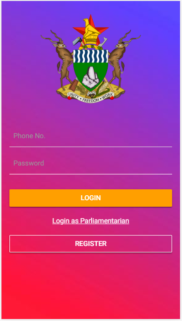
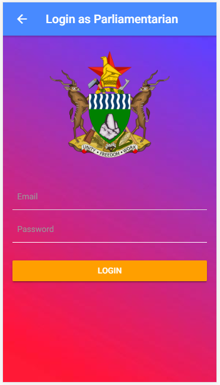
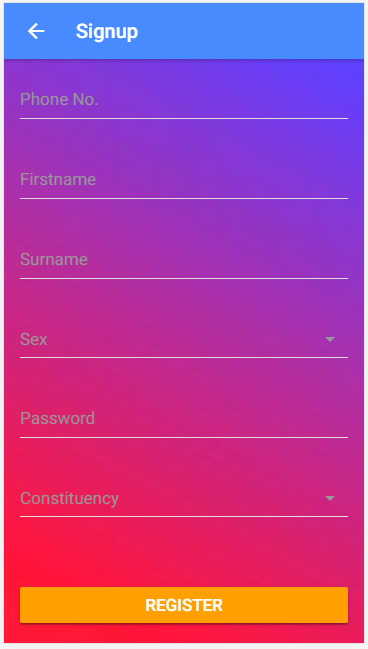
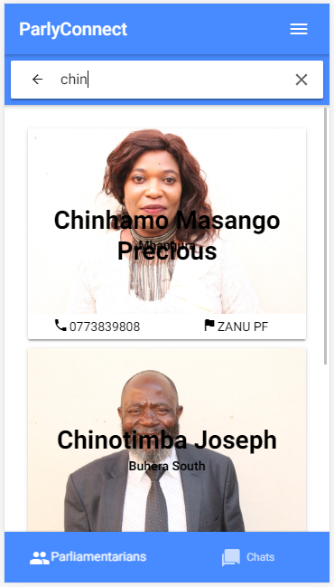
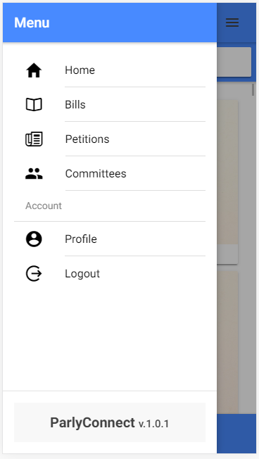
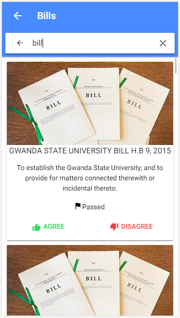
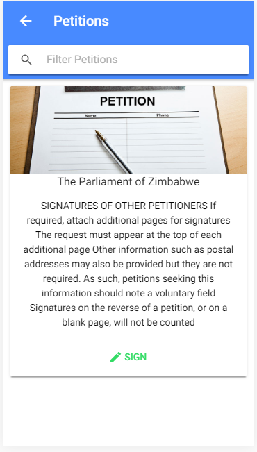
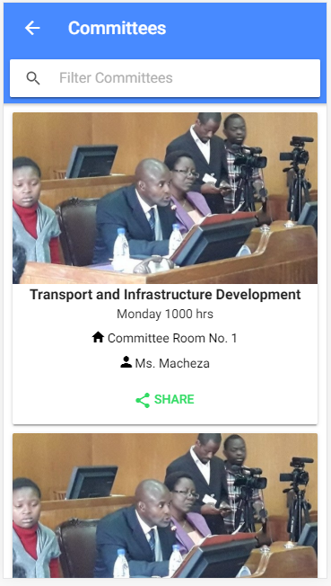
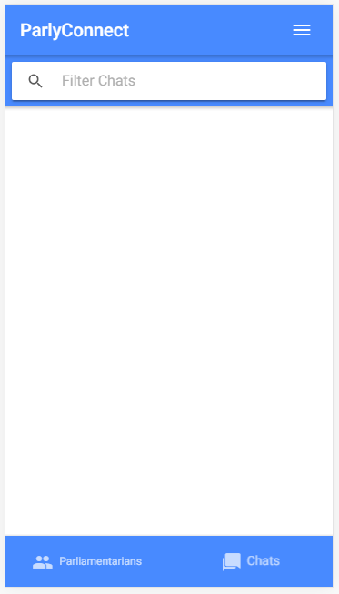

# ParlyConnect
ParlyConnect is a civic technology that promotes Government to Citizen Interaction to increase accountability and transparency. The app allows citizens and members of parliament to communicate and share opinions. Citizens can view and vote in support or against Bills. Citizens can also petition the government through digital signatures. MPs can view how their constituents feel about a certain topic through votes and chats.

## Screenshots

